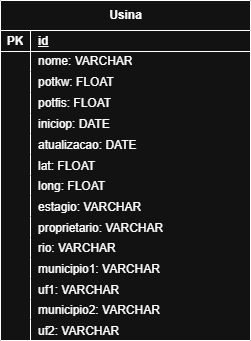

# MC536: Segunda Avaliação
Segundo projeto para a matéria MC536, oferecida no 1º semestre de 2025 pelo [Instituto de Computação da Universidade Estadual de Campinas (UNICAMP)](https://ic.unicamp.br/), e ministrada pelo docente [Breno Bernard Nicolau de França](https://ic.unicamp.br/docente/breno-bernard-nicolau-de-franca/).  
  
Este projeto é autoria de:
  - [Daniel Baltieri Ismael (247855)](https://github.com/DBisma)
  - [Gustavo Costa Salles Silva (198487)](https://github.com/gu-css)
  - [João Emílio Ferreira (247184)](https://github.com/Gmilho/)

## Objetivos e Decisões
O objetivo desta segunda avaliação foi transferir para um novo banco de dados os _datasets_ utilizados para a construção do banco de dados da primeira avaliação. Para isso, foi escolhido o **[duckDB](https://duckdb.org/)**, que proporciona análises estáticas rápidas sobre um grande volumes de dados e é especialmente eficiente quando inserções de dados são pouco frequentes, como é o caso presente. Dentre outras vantagens deste banco de dados:
   * As consultas podem ser realizadas diretamente por Python, bastando apenas importar a biblioteca do duckDB;
   * Por conta de ser um banco colunar, há uma maior compressão dos dados, diminuindo o tamanho necessário para armazenar o banco;
   * Por conta disso, o banco pode até tornar-se portável, possibilitando consultas em um banco hospedado em um _notebook_;
   * O banco de dados é _in-memory_: Dados relevantes em processo são carregados na memória _RAM_ conforme necessário, tornando o acesso muito mais rápido do que é o caso com dados armazenados em disco rígido;
   * Transações consistentes e seguras garantidas pelas propriedades _ACID_; na ocasião de uma transação falhar, o sistema faz um _rollback_. 

## Resultados
Seguindo à transferência, o banco foi reduzido a apenas uma tabela:  
  

...quem, novamente, é armazenada de forma comprimida e carregada na memória conforme o necessário para buscas rápidas. 5 _queries_ foram então realizadas, e podem ser reproduzidas seguindo as instruções que seguem adiante.

## Obtendo Dependências e Executando
Este projeto depende de [Python 3](https://www.python.org/), [Pip](https://pypi.org/project/pip/), [Jupyter](https://jupyter.org/) e [DuckDB](https://duckdb.org/).
No sistema operacional Ubuntu e em seus similares, as instruções para obtenção dessas dependências são:

1. Abra seu emulador de terminal de preferência e certifique-se de possuir _Python 3_ e _pip_ instalados com os comandos `python3 --version` e `pip --version`; baixe os dois caso não possua.
2. Escolha um diretório para armazenar o ambiente e suas as dependências com o comando: `python3 -m venv <caminho>` (e.g. `python3 -m venv /home/username/Documents/python3-Envs/proj2`);
3. Selecione o ambiente criado com o comando `source <caminho>/bin/activate` (e.g. `source /home/username/Documents/python3-Envs/proj2/bin/activate`);
4. Uma vez selecionado, utilize os comandos `pip install duckdb` e `pip install jupyter` para instalar outras duas demais dependências.
5. Navegue até o diretório em que clonou este projeto (e.g: `cd /home/username/Documents/GitHub/MC536_Av2`)
6. Execute o comando `jupyter notebook`, que deverá abrir um explorador de arquivos em seu navegador.
7. Selecione o projeto **_ava_dois_notebook.ipynb_**;
8. Por fim, basta executar os blocos de código sequencialmente. Comece pelo começo, vá até o final, e então pare. Os resultados são exibidos na própria página.

## Créditos e Agradecimentos
_Datasets_ ([1](https://repositorio.seade.gov.br/dataset/infraestrutura-e-meio-ambiente/resource/f175c301-b9c9-46d0-9522-1e1f7134846c?inner_span=True),[2](https://repositorio.seade.gov.br/dataset/infraestrutura-e-meio-ambiente/resource/abf3787f-5d6c-4f63-81e0-79021464b6c4)) disponibilizados publicamente pelo SEADE.  
Agradecimentos especiais aos nossos PADs pela paciência infinita demonstrada durante o semestre para com este grupo.
