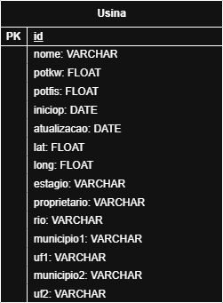

Segundo projeto para a matéria MC536 ministrada no 1º semestre de 2025 pelo professor Breno Bernard Nicolau de França, Instituto de Computação da Universidade Estadual de Campinas (UNICAMP).
Autoria de:
  - Daniel Baltieri Ismael      (247855)
  - Gustavo Costa Salles Silva  (198487)
  - João Emílio Ferreira        (247184)

[Todo: Colocar links]

Dependências
proj1:
jupyter, python3, pip, postgresql (proj1), psycopg(proj1), duckdb (proj2)
*Introdução*

> Comentar sobre análises estatísticas eficientes, baixo volume de inserção
> Comentar sobre os dados que podem ser buscados

Nós escolhemos o DuckDB como o banco para o cenário A pelos seguintes motivos:  
    * As consultas podem ser realizadas diretamente pelo python, basta apenas importar a biblioteca do duckdb  
    * São muitos os dados que os analistas precisam guardar nos CSVs e esses dados não precisam ser acessados com frequência  
    * Por conta de ser um banco colunar, há uma maior compressão dos dados, diminuindo o tamanho necessário para armazenar o banco e até o tornando portável, sendo assim possível de realizar  
      consultas em um notebook, além disso, como a database é in-memory, por conta de estar armazenada na ram o acesso de leitura é bem mais rápido do que bancos armazenados em disco rígido; Vale ressaltar também que não é o banco todo que está sendo colocado na memória ram e sim apenas a parte sendo processada  
    * Suporte para consultas ACID, então as transações são mais consistentes e seguras, caso uma transação falhe, o sistema faz um rollback  
    * E por ser apenas uma tabela, manter transações ACID se tornam bem mais simples de manter  
Acaba que o DuckDB é o banco perfeito para o tipo de aplicação do cenário  
  
O banco foi reduzido a apenas uma tabela:  

